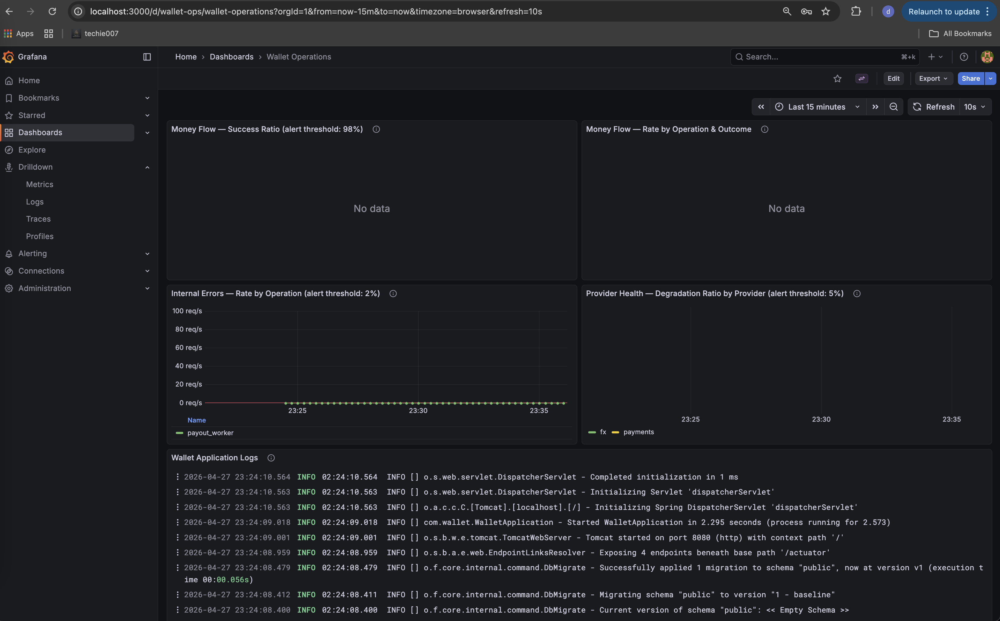

# RUNBOOK

## Metrics (Actuator / Prometheus)

Expose: `GET /actuator/prometheus`. Grafana dashboard at `http://localhost:3000` (admin / admin) — pre-built **Wallet Operations** dashboard with panels for all three alerts and a live log panel. Starts automatically with `docker compose up --build`.



*Example view of the Wallet Operations Grafana dashboard with the three top alert panels and live application logs.*

**Alert delivery not configured:** thresholds below are defined and visible in Grafana but no delivery pipeline (Prometheus Alertmanager, PagerDuty, OpsGenie, Slack webhook) is wired up. In production, should configure Alertmanager to route threshold breaches to the on-call rotation — until then thresholds are actionable only if someone is actively watching the dashboard.

---

**`wallet_money_flow_total{operation, outcome}`** — the primary health signal.

Counts every money operation attempted, tagged by what it was and how it ended:
- `operation`: `deposit`, `transfer`, `withdrawal`, `fx_exchange`
- `outcome`: `success` — completed normally; `business_reject` — expected rejection (insufficient funds, idempotency conflict, quote expired); `disabled` — operator killswitch was active

`business_reject` is not an error — it is normal domain behavior. A spike in `business_reject` for `withdrawal` means users have low balances, not a platform problem. Watching the **success ratio** (success / non-disabled total) tells you whether users can actually move money.

---

**`wallet_internal_errors_total{operation}`** — platform failures, not business or provider failures.

Counts unexpected failures (DB errors, application bugs, etc.) by the operation running when they occurred: `deposit`, `transfer`, `withdrawal`, `fx_exchange`, `payout_worker`. This metric explicitly excludes provider-side degradation (tracked separately below) and business rejections. A spike here points directly at the platform — infrastructure, a bad deployment, or a bug. The `operation` label narrows scope immediately: `payout_worker` means the outbox worker is broken, not the HTTP layer.

---

**`wallet_provider_health_total{provider, outcome}`** — external dependency health.

Counts calls to external providers by who and how:
- `provider`: `fx` (FX rate provider for quotes and exchanges), `payments` (payout/withdrawal provider)
- `outcome`: `request` (total calls), `degraded` (hard failure, no result returned), `degraded_served_stale` (FX fallback: a cached rate was served instead of a live one)

Watching the degraded ratio by provider tells you which external system is struggling without reading logs. `degraded_served_stale` appearing for `fx` means the stale-rate fallback is active — the system is limping but still serving FX. Hard `degraded` with no stale means operations are failing with 503.

---

**Supporting metrics:**
- `http_server_requests_seconds_*` — route latency and HTTP status auto-provided by Spring Boot Actuator; useful for correlating a money-flow drop with a specific route becoming slow or erroring.

**Not yet implemented (recommended future addition):**
- `wallet_pending_amount_total` — a gauge over `sum(balance_projections.pending_amount)` that would surface uncleared inbound funds from batch transfers; monotonic growth would signal a stalled settlement worker. Requires registering a custom Micrometer gauge that queries the DB on a schedule.

## Top 3 alerts (example thresholds)

> **Reading `rate()` in these queries:** `rate(some_counter[10m])` gives the per-second average increase of a counter over the last 10 minutes — not a raw count. A value of `0.05` means ~3 events per minute. Thresholds like `> 0.02` are rates, not counts. `sum()` adds the rate across all running instances.

1. **Money-flow success ratio drops:**
   `sum(rate(wallet_money_flow_total{outcome="success"}[10m])) / sum(rate(wallet_money_flow_total{outcome!="disabled"}[10m])) < 0.98`
   **Why page:** users are failing to complete core money actions (deposit, transfer, withdrawal, FX exchange) at expected reliability. This is a broad signal — triage DB health, recent deployments, and infrastructure first. The `outcome!="disabled"` filter ensures requests intentionally rejected by an operator killswitch do not count against the success ratio.
   *Example: 100 operations/min total, 97 succeeding → ratio 0.97 → alert fires.*


2. **Internal error ratio rises:**
   `sum(rate(wallet_internal_errors_total[10m])) by (operation) / sum(rate(wallet_money_flow_total[10m])) by (operation) > 0.02`
   **Why page:** unexpected platform failures are breaking flows — these are not business rejections (insufficient funds, validation) and not provider failures. Likely causes: DB connectivity, connection pool exhaustion, out-of-memory, or application bug. Investigate infrastructure and application logs.
   *Example: 100 deposits/min, 3 throwing unexpected DB errors → internal error rate 0.05/s for `deposit` → alert fires. Compare: a user hitting insufficient funds increments `business_reject`, not this metric.*


3. **Provider degradation ratio rises:**
   `sum(rate(wallet_provider_health_total{outcome=~"degraded|degraded_served_stale"}[10m])) by (provider) / sum(rate(wallet_provider_health_total{outcome="request"}[10m])) by (provider) > 0.05`
   **Why page:** one of the two external dependencies is degraded. The `provider` label identifies which:
   - `provider="fx"` — the FX rate provider is failing; cross-currency operations are returning 503 or being served on stale rates.
   - `provider="payments"` — the payout provider is failing; withdrawals are retrying via the outbox worker and will be reversed if retries exhaust, restoring user balances automatically but leaving users without their intended payout.
   *Example: 20 FX quotes/min, 2 failing → degradation ratio 0.10 for `provider="fx"` → alert fires.*

## General log investigation

Use this section for any alert before diving into alert-specific playbooks.

1. Define the investigation window first (for example, "last 10 minutes", matching alert queries).
2. Start with broad error signals in app logs:
   - Search for `ERROR` and `Exception` in the same window.
   - Group by exception class and endpoint/operation to find dominant failure patterns.
3. Narrow by operation and correlation fields:
   - Filter logs by operation names used in metrics: `deposit`, `transfer`, `withdrawal`, `fx_exchange`, `payout_worker`.
   - Follow request/correlation IDs across controller -> command handler -> repository/worker logs to reconstruct one failing flow end-to-end.
   - Confirm ledger state for a suspicious flow: `SELECT le.entry_type, le.created_at, ll.currency, ll.amount FROM ledger_entries le JOIN ledger_lines ll ON ll.entry_id = le.id WHERE le.correlation_id = '<uuid>' ORDER BY le.created_at;`
4. Separate platform failures from expected business outcomes:
   - Platform: DB timeout, connection errors, null pointer, serialization/parsing failures.
   - Business: insufficient funds, invalid amount, quote expired, idempotency conflict.
5. Correlate log spikes with runtime events:
   - recent deploys,
   - config flips in `runtime_config`,
   - provider status incidents,
   - DB or infrastructure alarms.
6. Capture a short incident snapshot before mitigation: top exception(s), top affected operation(s), first seen time, and current trend (rising/stable/recovering).

**Quick local commands (Docker Compose setup):**
- App container logs: `docker compose logs wallet --since=15m`
- Worker logs: `docker compose logs wallet --since=15m | rg "payout|outbox|WITHDRAWAL_REVERSAL"`
- Error-focused scan: `docker compose logs wallet --since=15m | rg "ERROR|Exception|Caused by"`
- FX-related scan: `docker compose logs wallet --since=15m | rg "fx|quote|exchange|degraded|stale"`
- Transfer/withdrawal scan: `docker compose logs wallet --since=15m | rg "transfer|withdraw|insufficient|idempotency"`

**Quick DB queries** (`docker compose exec postgres psql -U wallet wallet`):
- Current killswitch state: `SELECT * FROM runtime_config;`
- Payout outbox status breakdown: `SELECT status, COUNT(*), MAX(attempts) FROM payout_outbox GROUP BY status ORDER BY status;`
- Trace a flow by correlation ID: `SELECT le.entry_type, le.created_at, ll.currency, ll.amount FROM ledger_entries le JOIN ledger_lines ll ON ll.entry_id = le.id WHERE le.correlation_id = '<uuid>' ORDER BY le.created_at;`
- User balance snapshot: `SELECT currency, amount, pending_amount FROM balance_projections WHERE user_id = '<uuid>';`

## Playbooks — top 3 alerts

### 1) Money-flow success ratio drops

1. Confirm denominator health first: check total request volume (`wallet_money_flow_total{outcome!="disabled"}`) to rule out low-traffic noise.
2. Break down failures by `operation` and `outcome` in the same 10m window to isolate where success is being lost (for example `transfer` vs `withdrawal`, `business_reject` vs internal failures).
3. Correlate with HTTP 5xx and latency (`http_server_requests_seconds_*`) by route to identify a hot endpoint or rollout-induced regression.
4. Verify data-plane dependencies quickly:
   - DB reachability/latency and connection pool saturation.
   - FX provider health (if transfer cross-currency or FX paths are impacted).
   - Payment provider health (if withdrawal paths are impacted).
5. If the drop is broad across operations, treat as platform incident: pause risky deploys, rollback recent release if needed, and escalate infra + app owner together.

### 2) Internal error ratio rises

1. Use `wallet_internal_errors_total` grouped by `operation` to identify the failing command path (`deposit`, `transfer`, `withdrawal`, `fx_exchange`, `payout_worker`).
2. Pull application logs for that operation and classify top exception classes (DB timeouts, pool exhaustion, null pointer, serialization/validation bugs).
3. Check runtime pressure:
   - DB pool in-use/max and wait time.
   - JVM memory/GC pressure and CPU saturation.
   - Error burst timing relative to deploy/config changes.
4. Validate this is truly internal and not business/provider-driven by comparing with:
   - `wallet_money_flow_total{outcome="business_reject"}`
   - `wallet_provider_health_total{outcome=~"degraded|degraded_served_stale"}`
5. If localized to one operation, mitigate that path only (temporary feature switch or targeted rollback). If cross-operation, execute full incident response and prioritize platform stability.

### 3) Provider degradation ratio rises

1. Check **which `provider` label is moving** — `fx` or `payments` — to pick the right path below.

---

2. **If `provider="fx"`:**

   **Assess the failure mode first:**
   - `outcome="degraded_served_stale"` rising → stale fallback is active, FX is limping.
   - All failures hard `degraded`, no stale → FX is fully broken.

   **Short outage (acceptable minutes or intermittent) → enable bounded stale serving**
   - Takes effect in ≤5 s, no redeploy:
     `UPDATE runtime_config SET value = '30' WHERE key = 'wallet.fx.stale-rate-ttl-seconds';`
   - This serves a cached FX rate only when its age is within `wallet.fx.stale-rate-ttl-seconds`; outside that window requests remain hard degraded.
   - Open/escalate a support ticket with the FX provider if degradation persists beyond your incident SLO, and record their incident ID in the timeline.
   - Watch conversion correctness; communicate degraded-mode SLA to stakeholders.
   - Revert when provider recovers: `UPDATE runtime_config SET value = '0' WHERE key = 'wallet.fx.stale-rate-ttl-seconds';`

   **Prolonged outage or planned maintenance → disable FX entirely**
   - Use when stale rates are too old to be safe, or the outage window is known to be long.
   - All FX quotes, exchanges, and cross-currency transfers return `503 SERVICE_DISABLED`. These land as `outcome="disabled"` and do **not** count against the success-ratio alert.
   - Takes effect in ≤5 s, no redeploy:
     `INSERT INTO runtime_config (key, value) VALUES ('wallet.fx.enabled', 'false') ON CONFLICT (key) DO UPDATE SET value = 'false';`
   - Re-enable after provider restores: `UPDATE runtime_config SET value = 'true' WHERE key = 'wallet.fx.enabled';`
   - Confirm `wallet_provider_health_total{provider="fx", outcome="degraded"}` returns to zero before closing the incident.
   - If outage duration is uncertain, request ETA updates from the provider and post them in incident comms at regular intervals.

---

3. **If `provider="payments"`:**
   - Withdrawals are retrying via the outbox worker with exponential backoff. User balances are protected: if retries exhaust, a `WITHDRAWAL_REVERSAL` ledger entry restores the debited amount to available balance automatically. **The system is financially self-healing — ledger correctness is guaranteed. User experience is not: no notification is sent.**
   - Check outbox status breakdown to understand how many withdrawals are in-flight vs exhausted: `SELECT status, COUNT(*), MAX(attempts) FROM payout_outbox GROUP BY status ORDER BY status;`
   - Query users with reversed withdrawals to assess impact: `SELECT user_id, COUNT(*) FROM payout_outbox WHERE status = 'FAILED' GROUP BY user_id ORDER BY COUNT(*) DESC` — if the count is non-trivial, plan manual outreach so users know their funds are safe and can re-initiate.
   - Correlate with `wallet_internal_errors_total{operation="payout_worker"}` to separate a provider outage from a local worker or DB fault.
   - Reach out to the payments provider support/on-call channel for ETA, known blast radius, and recommended client retry posture; track ticket/reference IDs.

   **Prolonged outage → disable withdrawals entirely**
   - Use when the provider outage is expected to be long and you want to stop new withdrawals from entering the outbox (preventing further debits that will inevitably reverse). In-flight outbox entries already queued continue to retry independently.
   - New withdrawal requests return `503 SERVICE_DISABLED`, counted as `outcome="disabled"` — no debit, no reversal needed.
   - Takes effect in ≤5 s, no redeploy:
     `INSERT INTO runtime_config (key, value) VALUES ('wallet.withdrawals.enabled', 'false') ON CONFLICT (key) DO UPDATE SET value = 'false';`
   - Re-enable after provider restores: `UPDATE runtime_config SET value = 'true' WHERE key = 'wallet.withdrawals.enabled';`

---

4. Inspect **recent deploy or configuration changes** and the provider's own status page regardless of which provider is affected.

## Investigating a specific operation

Use when you have an identifier from a customer report, support ticket, or log line. Connect: `docker compose exec postgres psql -U wallet wallet`

---

### By correlation ID (X-Request-Id)
One correlation ID maps to one HTTP request — fastest trace path.

```sql
-- Was the request accepted, rejected, or replayed?
SELECT occurred_at, command_type, outcome, ledger_entry_id, idempotency_key, details
FROM financial_audit_events
WHERE correlation_id = '<correlation_id>'
ORDER BY occurred_at;

-- Ledger entry posted by that request (empty = rejected before commit)
SELECT id, entry_type, metadata, created_at
FROM ledger_entries
WHERE correlation_id = '<correlation_id>';

-- Money lines within that entry
SELECT ll.user_id, ll.currency, ll.amount
FROM ledger_lines ll
JOIN ledger_entries le ON ll.entry_id = le.id
WHERE le.correlation_id = '<correlation_id>';
```

---

### By user ID
Start here when the complaint is "something is wrong with my account."

```sql
-- Current balance (amount = spendable; pending_amount = uncleared batch credits)
SELECT currency, amount, pending_amount FROM balance_projections WHERE user_id = '<user_id>';

-- Last 20 audit events for this user
SELECT occurred_at, command_type, outcome, correlation_id, details
FROM financial_audit_events
WHERE subject_user_id = '<user_id>'
ORDER BY occurred_at DESC LIMIT 20;

-- Last 20 ledger movements
SELECT le.entry_type, le.created_at, ll.currency, ll.amount, le.correlation_id
FROM ledger_lines ll
JOIN ledger_entries le ON ll.entry_id = le.id
WHERE ll.user_id = '<user_id>'
ORDER BY le.created_at DESC LIMIT 20;

-- Open payout outbox entries (withdrawal in-flight, retrying, or reversed)
SELECT id, status, attempts, last_attempted_at, next_attempt_at, currency, amount
FROM payout_outbox
WHERE user_id = '<user_id>'
ORDER BY created_at DESC;
```

---

### By idempotency key
Use when a client says "I sent this key but I'm not sure if the operation ran."
Key is scoped per user — stored as `{userId}|{clientKey}`.

```sql
SELECT ae.command_type, ae.outcome, ae.occurred_at, ae.details,
       le.entry_type, le.metadata
FROM financial_audit_events ae
LEFT JOIN ledger_entries le ON ae.ledger_entry_id = le.id
WHERE ae.idempotency_key = '<userId>|<clientKey>';
```

- `outcome = 'SUCCESS'` → committed; `ledger_entry_id` points to the posted entry.
- `outcome = 'REPLAY'` → duplicate detected; original entry returned to the caller.
- `outcome = 'BUSINESS_REJECT'` → rejected (insufficient funds, quote expired, etc.); no ledger entry created.

---

### By quote ID (FX exchange not settling)

```sql
SELECT id, user_id, sell_currency, buy_currency, sell_amount, buy_amount,
       expires_at, consumed_at, served_from_stale, priced_at
FROM fx_quotes WHERE id = '<quote_id>';
```

- `consumed_at IS NULL` → quote was never exchanged; check whether it expired.
- `served_from_stale = true` → rate came from cache after provider failure; flag for conversion accuracy review.

---

### By ledger entry ID
Use when you have an entry ID from an outbox row or another reference.

```sql
-- Entry detail and all money lines
SELECT le.entry_type, le.metadata, le.created_at, le.correlation_id,
       ll.user_id, ll.currency, ll.amount
FROM ledger_entries le
JOIN ledger_lines ll ON ll.entry_id = le.id
WHERE le.id = '<entry_id>';

-- Associated payout outbox row (withdrawals only)
SELECT status, attempts, last_attempted_at, next_attempt_at, provider_ref
FROM payout_outbox WHERE ledger_entry_id = '<entry_id>';
```
